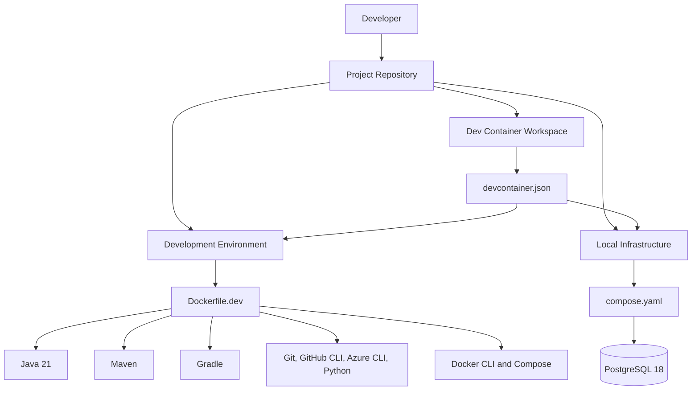
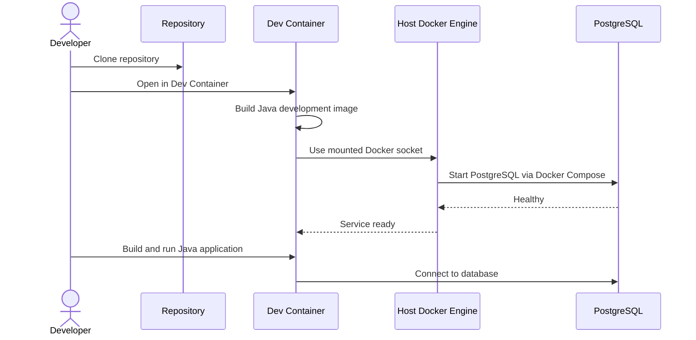
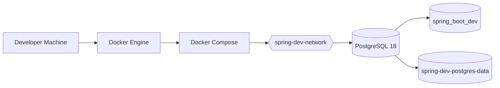
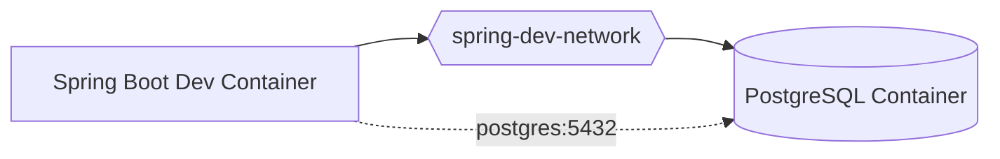
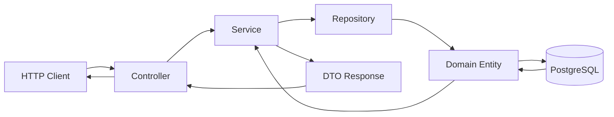
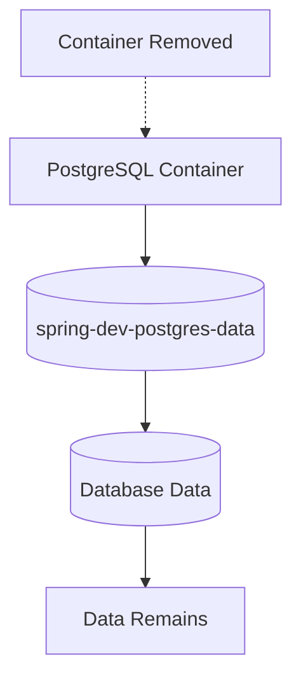
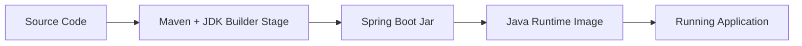
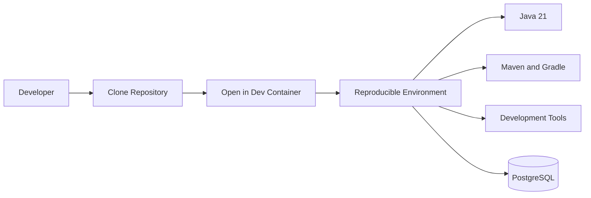
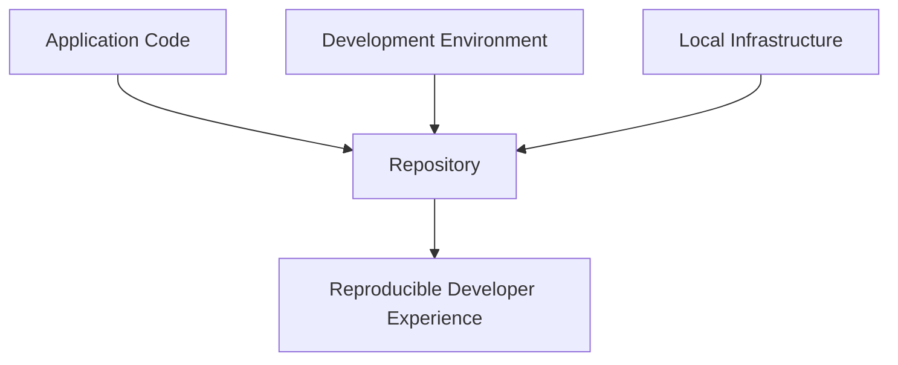

# Spring Boot Dev Container Workshop

A hands-on guide for building Java and Spring Boot applications inside **Dev Containers** with Docker Compose and local development infrastructure.

This project focuses on a common problem:

> "Just clone the project and run it."

In real projects, that usually means installing the correct JDK, Maven or Gradle version, Docker, database tools, CLI tools, environment variables, and local services before writing any code.

This repository takes a different approach: the development environment lives inside the project.

```text
Clone -> Open in Dev Container -> Start Developing
```

## Learning Goals

After working through this repository, you should understand how to:

1. Clone a Java project and open it in a Dev Container.
2. Use a reproducible Java 21 development environment.
3. Work with Maven and Gradle inside the container.
4. Run local infrastructure with Docker Compose.
5. Start and inspect a local PostgreSQL database.
6. Connect a Spring Boot application to PostgreSQL.
7. Run builds and tests without relying on a shared remote database.
8. Explain how `Dockerfile.dev`, `compose.yaml`, and `devcontainer.json` work together.

## Current Repository Status

This repository contains the **development environment foundation** and a manual setup script for generating a Spring Boot application.

The repository is designed to build up in stages:

1. Understand the development environment.
2. Generate a Spring Boot application with the setup script.
3. Connect the application to the local PostgreSQL service.

## Architecture Overview

The project separates three concerns:



| Component | Responsibility |
| --- | --- |
| `.devcontainer/Dockerfile.dev` | Defines the developer workstation image and installed tools. |
| `Dockerfile` | Defines the production application image. |
| `.devcontainer/compose.yaml` | Defines local services used during development, currently PostgreSQL. |
| `.devcontainer/devcontainer.json` | Tells VS Code or Dev Containers how to build and enter the workspace. |
| `.devcontainer/scripts/` | Contains lifecycle and verification scripts used by the container. |
| `scripts/create-spring-boot-project.sh` | Manually generates a Spring Boot project when learners are ready to add application code. |

## Project Structure

```text
spring-boot-devcontainer-workshop/
|
+-- .devcontainer/
|   |
|   +-- Dockerfile.dev
|   +-- compose.yaml
|   +-- devcontainer.json
|   |
|   +-- scripts/
|       +-- post-create.sh
|       +-- show-devcontainer-summary.sh
|       +-- start-postgres.sh
|       +-- verify-environment.sh
|
+-- README.md
+-- LICENSE
+-- Dockerfile
+-- .dockerignore
+-- pom.xml
+-- mvnw
+-- mvnw.cmd
+-- scripts/
|   +-- create-spring-boot-project.sh
|   +-- reset-generated-spring-boot-project.sh
|   +-- run-spring-boot-app.sh
+-- src/
    +-- main/
    |   +-- java/com/example/workshop/
    |   |   +-- WorkshopAppApplication.java
    |   |   +-- controller/
    |   |   +-- service/
    |   |   +-- repository/
    |   |   +-- domain/
    |   |   +-- dto/
    |   +-- resources/
    |       +-- application.properties
    +-- test/
        +-- java/com/example/workshop/
        +-- resources/application-test.properties
```

## File Responsibilities

### `.devcontainer/Dockerfile.dev`

Defines the development image used by the Dev Container.

It installs and verifies:

| Tool | Purpose |
| --- | --- |
| Java 21 | Java and Spring Boot development |
| Maven 3.9.11 | Java build automation |
| Gradle 9.1.0 | Java build automation |
| Git | Source control |
| GitHub CLI | GitHub operations |
| Azure CLI | Azure development and deployment |
| Python 3 | Scripting and automation |
| Docker CLI | Container management |
| Docker Buildx | Image building |
| Docker Compose | Local infrastructure orchestration |
| Bash, curl, jq, zip, unzip | Common development utilities |

The image is based on:

```text
mcr.microsoft.com/devcontainers/java:21-bookworm
```

### `.devcontainer/compose.yaml`

Defines local infrastructure for the project.

Currently, it provides:

| Service | Version | Purpose |
| --- | --- | --- |
| PostgreSQL | 18 | Local application database |

The PostgreSQL service is intentionally separate from the development container. That mirrors a real application setup where the app and database run as separate services.

### `.devcontainer/devcontainer.json`

Defines how the workspace is opened inside VS Code or another Dev Containers compatible tool.

It configures:

| Setting | Purpose |
| --- | --- |
| `build.dockerfile` | Builds the Dev Container from `Dockerfile.dev`. |
| `workspaceFolder` | Opens the project under `/workspaces/...`. |
| `remoteUser` | Uses the standard `vscode` container user. |
| `mounts` | Mounts the host Docker socket for Docker CLI access. |
| `remoteEnv` | Provides PostgreSQL and Spring datasource environment variables. |
| `forwardPorts` | Forwards Spring Boot and PostgreSQL ports. |
| `customizations.vscode.extensions` | Installs Java, Spring Boot, Gradle, YAML, and Docker extensions. |
| `postCreateCommand` | Verifies the environment and starts PostgreSQL after the container is created. |
| `postStartCommand` | Runs `start-postgres.sh` whenever the container starts. |
| `postAttachCommand` | Prints a learner-friendly summary after VS Code attaches to the container. |

### `.devcontainer/scripts/`

| Script | Purpose |
| --- | --- |
| `post-create.sh` | Dev Container lifecycle hook that verifies the environment and starts services after creation. |
| `show-devcontainer-summary.sh` | Prints the workspace, tool versions, database connection details, and useful commands. |
| `start-postgres.sh` | Starts PostgreSQL, waits for readiness, and attaches the Dev Container to the PostgreSQL network. |
| `verify-environment.sh` | Verifies that required tools are installed and prints their versions. |

## Development Environment Flow



## Local PostgreSQL

The project uses PostgreSQL as the local database.



### Database Configuration

| Setting | Value |
| --- | --- |
| Database | `spring_boot_dev` |
| Username | `spring_boot` |
| Password | `spring_boot_dev_password` |
| Host port | `5432` |
| PostgreSQL version | `18` |
| Docker network | `spring-dev-network` |
| Docker volume | `spring-dev-postgres-data` |

From the host machine, connect through:

```text
localhost:5432
```

From another container on the same Docker network, connect through:

```text
postgres:5432
```

Important: inside a container, `localhost` means "this same container." It does not mean "the PostgreSQL container." Container-to-container communication should use the Compose service name, which is `postgres`.

## Container Networking

The intended service-to-service model is:



The Dev Container starts PostgreSQL by using the mounted host Docker socket. The `start-postgres.sh` script also attaches the Dev Container to `spring-dev-network`, so `postgres:5432` works from inside the Dev Container.

## Getting Started

### Prerequisites

Before opening the Dev Container, install:

1. Docker Desktop, Docker Engine, or a compatible container runtime.
2. VS Code.
3. The Dev Containers extension for VS Code.
4. Git.

### 1. Clone the Repository

```bash
git clone <repository-url>
cd spring-boot-devcontainer-workshop
```

### 2. Open in a Dev Container

In VS Code:

1. Open the repository folder.
2. Open the Command Palette.
3. Run `Dev Containers: Reopen in Container`.

VS Code will build the development image from `.devcontainer/Dockerfile.dev`.

### 3. Verify the Environment

Inside the Dev Container terminal, run:

```bash
bash .devcontainer/scripts/verify-environment.sh
```

This checks Java, Maven, Gradle, Git, GitHub CLI, Azure CLI, Python, Docker, and Docker Compose.

### 4. Generate the Spring Boot Application

The repository starts as a Dev Container workshop foundation. Generate the Spring Boot application manually when ready:

```bash
bash scripts/create-spring-boot-project.sh
```

The script creates:

1. `pom.xml`
2. Maven wrapper files
3. A layered `src/main/java/...` package structure
4. `src/main/resources/application.properties`
5. A sample `/api/hello` endpoint
6. A small `Customer` API backed by Spring Data JPA
7. A `test` profile using H2
8. A focused `CustomerServiceTest`

The generated application follows a layered Spring Boot structure commonly used in professional Java backend teams:

```text
src/main/java/com/example/workshop/
|
+-- WorkshopAppApplication.java
|
+-- controller/
|   +-- WelcomeController.java
|   +-- CustomerController.java
|
+-- service/
|   +-- CustomerService.java
|
+-- repository/
|   +-- CustomerRepository.java
|
+-- domain/
|   +-- Customer.java
|
+-- dto/
    +-- CreateCustomerRequest.java
    +-- CustomerResponse.java
```

The request flow looks like this:



Each layer has a specific job:

| Layer | Responsibility |
| --- | --- |
| `controller` | Receives HTTP requests and returns HTTP responses. |
| `service` | Holds business logic and transaction boundaries. |
| `repository` | Handles database access through Spring Data JPA. |
| `domain` | Represents persistent business objects. |
| `dto` | Defines request and response shapes for the API. |

After the project is generated, run the tests:

```bash
./mvnw test
```

Start the application:

```bash
bash scripts/run-spring-boot-app.sh
```

The run script starts PostgreSQL first, then runs:

```bash
./mvnw spring-boot:run
```

Then test it:

```bash
curl http://localhost:8080/api/hello
curl http://localhost:8080/api/customers
curl http://localhost:8080/actuator/health
```

Create a customer:

```bash
curl -X POST http://localhost:8080/api/customers \
  -H "Content-Type: application/json" \
  -d '{"name":"Ada Lovelace","email":"ada@example.com"}'
```

List customers again:

```bash
curl http://localhost:8080/api/customers
```

Get one customer by id:

```bash
curl http://localhost:8080/api/customers/1
```

Try validation:

```bash
curl -X POST http://localhost:8080/api/customers \
  -H "Content-Type: application/json" \
  -d '{"name":"","email":"not-an-email"}'
```

Stop the running application with `Ctrl+C`.

### Reset the Generated Application

If a generated Spring Boot application already exists and the repository needs to return to the pre-generation workshop state, run:

```bash
bash scripts/reset-generated-spring-boot-project.sh --yes
```

This removes generated application files such as `pom.xml`, `mvnw`, `.mvn/`, `src/`, and `target/`. It does not remove `.devcontainer/`, `scripts/`, `README.md`, or `LICENSE`.

## Working with PostgreSQL

### Validate the Compose File

```bash
docker compose \
  -f .devcontainer/compose.yaml \
  config
```

This validates the Docker Compose configuration without starting containers.

### Start PostgreSQL

```bash
docker compose \
  -f .devcontainer/compose.yaml \
  up -d
```

Docker will create:

1. A PostgreSQL container.
2. A Docker network.
3. A persistent Docker volume.

### Check the Container

```bash
docker compose \
  -f .devcontainer/compose.yaml \
  ps
```

You should eventually see PostgreSQL reported as healthy:

```text
Up ... (healthy)
```

The first startup may briefly show:

```text
health: starting
```

Wait a few seconds and check again.

### Check PostgreSQL Readiness

```bash
docker compose \
  -f .devcontainer/compose.yaml \
  exec postgres \
  pg_isready \
  -U spring_boot \
  -d spring_boot_dev
```

Expected output:

```text
/var/run/postgresql:5432 - accepting connections
```

### Open a PostgreSQL Shell

```bash
docker compose \
  -f .devcontainer/compose.yaml \
  exec postgres \
  psql \
  -U spring_boot \
  -d spring_boot_dev
```

Expected prompt:

```text
spring_boot_dev=#
```

Useful commands inside `psql`:

```sql
SELECT current_database();
```

```text
\conninfo
\l
\dt
\q
```

## PostgreSQL Persistence

The database uses a named Docker volume:

```text
spring-dev-postgres-data
```

That volume allows database data to survive container recreation.



### Stop PostgreSQL

```bash
docker compose \
  -f .devcontainer/compose.yaml \
  stop
```

The database data remains intact.

### Start PostgreSQL Again

```bash
docker compose \
  -f .devcontainer/compose.yaml \
  start
```

### Remove Containers and Network

```bash
docker compose \
  -f .devcontainer/compose.yaml \
  down
```

This removes the PostgreSQL container and network. The named database volume remains.

### Completely Reset PostgreSQL

```bash
docker compose \
  -f .devcontainer/compose.yaml \
  down -v
```

Warning: this deletes the `spring-dev-postgres-data` volume and all local PostgreSQL data.

The next time PostgreSQL starts, Docker will initialize a fresh database.

## Build the Development Image Manually

The development image can also be built independently from VS Code.

The development image is for the developer workstation. It includes tools such as Maven, Gradle, GitHub CLI, Azure CLI, Python, Docker CLI, and Docker Compose.

From the repository root:

```bash
docker build \
  -f .devcontainer/Dockerfile.dev \
  -t spring-boot-devcontainer:dev \
  .
```

## Verify the Development Image Manually

```bash
docker run --rm spring-boot-devcontainer:dev bash -lc '
echo "===== JAVA ====="
java --version

echo "===== MAVEN ====="
mvn --version

echo "===== GRADLE ====="
gradle --version

echo "===== GIT ====="
git --version

echo "===== GITHUB CLI ====="
gh --version

echo "===== AZURE CLI ====="
az version

echo "===== PYTHON ====="
python3 --version
pip3 --version

echo "===== DOCKER ====="
docker --version
docker compose version
'
```

This verifies that the image contains the expected tooling.

## Production Docker Image

The root-level `Dockerfile` is different from `.devcontainer/Dockerfile.dev`.

| File | Purpose | Contains |
| --- | --- | --- |
| `.devcontainer/Dockerfile.dev` | Developer environment | Java, Maven, Gradle, Git, CLIs, Docker tooling, shell utilities |
| `Dockerfile` | Production application image | Built Spring Boot jar and Java runtime |

The production image uses a multi-stage build:



Build the production image:

```bash
docker build \
  -t workshop-app:prod \
  .
```

Run it on the same Docker network as PostgreSQL:

```bash
docker run --rm \
  --name workshop-app \
  --network spring-dev-network \
  -p 8080:8080 \
  -e SPRING_DATASOURCE_URL=jdbc:postgresql://postgres:5432/spring_boot_dev \
  -e SPRING_DATASOURCE_USERNAME=spring_boot \
  -e SPRING_DATASOURCE_PASSWORD=spring_boot_dev_password \
  workshop-app:prod
```

Test the production container:

```bash
curl http://localhost:8080/api/hello
curl http://localhost:8080/api/customers
curl http://localhost:8080/actuator/health
```

Stop it with `Ctrl+C`.

The key difference:

```text
Development image: used by people while writing code.
Production image: used to run the built application.
```

## Current Verified Environment

The development image has been verified with the following major tools:

| Tool | Version |
| --- | --- |
| Java | 21.0.12 LTS |
| Maven | 3.9.11 |
| Gradle | 9.1.0 |
| Git | 2.55.0 |
| GitHub CLI | 2.97.0 |
| Azure CLI | 2.89.1 |
| Python | 3.11.2 |
| Docker | 29.7.2 |
| Docker Compose | 5.4.0 |

Exact patch versions may change as package repositories evolve.

## Why Dev Containers?

Without Dev Containers, each participant may need to manually install and configure:

```text
Developer Machine
|
+-- Java
+-- JAVA_HOME
+-- Maven
+-- Gradle
+-- Git
+-- Docker
+-- PostgreSQL
+-- Database credentials
+-- Environment variables
+-- Editor extensions
```

With Dev Containers, the project describes the development environment:



## Learning Path

Work through the repository in this order:

1. Review the repository structure.
2. Open the project in a Dev Container.
3. Run `verify-environment.sh` to inspect the installed tools.
4. Start PostgreSQL with Docker Compose.
5. Inspect the database using `psql`.
6. Run `scripts/create-spring-boot-project.sh` to generate the Spring Boot application.
7. Review the generated PostgreSQL configuration.
8. Run the application inside the Dev Container.
9. Run tests against local infrastructure.

## Key Lesson

The main idea is simple:



When the environment is part of the repository, developers spend less time setting up tools and more time building Java applications.
